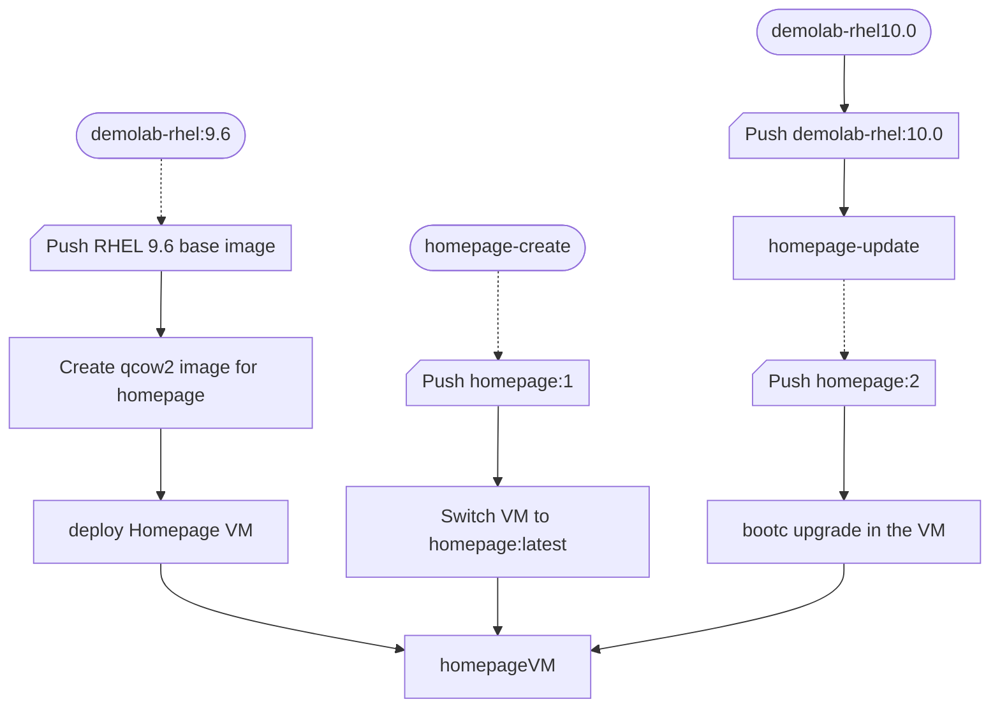

# Image Mode Demo

Image Mode Demo scripts
Draft container files, index.html, and config files to get an Image Mode workshop story going.

## The workflow



<!-- The following diagram will be updated as I work through the workflow. -->


## Set the environment

Setup of the terminal for building Image Mode images that we are going to push to the registry.
In this workshop we will be pushing to Red Hat Quay.

We recommend that you set two variables in the terminal you are using for the logins to the Red Hat Registry and Quay.io.

Using Quay we recommend that when you push the images to Quay that you make the repositories *public* by selecting the repository and using the Actions to set *Make Public*

```bash
QUAY_USER="your quay.io username not the email address"
REDHAT_USER="your Red Hat username, full email address may no longer work"
podman login -u $REDHAT_USER quay.io -p $REDHAT_PASSWORD && podman login -u $REDHAT_USER registry.redhat.io -p $REDHAT_PASSWORD
sudo mkdir -p /run/containers/0
sudo cp /run/user/1000/containers/auth.json /run/containers/0/auth.json #The user number 1000 may be different for your user
```

## Build the demo base image for RHEL

The first steps we will build our base (golden) image that we are going to use within the workshop. We will start with RHEL 9.6 and during the workshop update to RHEL 10.0.

We will name our base (golden) image `demolab-rhel:9.6` and also tag it as our latest rhel base image as `demolab-rhel:latest`.
We will then deploy a new virtual machine named `homepage` as this will be our new homepage http server.

Commands to build the RHEL 9.6 base image.

Change to the folder where you have cloned this repo

```bash
cd $HOME/imagemodedemo/demolab-rhel9.6
```

```bash
podman build -t quay.io/$QUAY_USER/demolab-rhel:latest -t quay.io/$QUAY_USER/demolab-rhel:9.6 -f Containerfile
```

If we want to test our image we can run it in a container.

You can log in with user `bootc-user` and password `redhat` and run `curl localhost` to test if the httpd service is running and you can see the base image welcome page. You can stop and exit the container with `sudo halt`.

```bash
podman run -it --rm --name demolab-rhel-96 -p 8080:80 quay.io/$QUAY_USER/demolab-rhel:9.6
```

Next we are going to push our images to the Quay repository.

```bash
podman push quay.io/$QUAY_USER/demolab-rhel:rhel9.6
podman push quay.io/$QUAY_USER/demolab-rhel:latest
```

Now we are ready to create the virtual machine disk image that we are going to import into our new VM.

In some cases the podman command is unable to initially pull the image from the registry and returns an error that you have to pull the image from the registry before building the disk. Use a pull command to syncronise the local images.

```bash
sudo podman pull quay.io/$QUAY_USER/demolab-rhel:9.6
```

```bash
sudo podman run \
--rm \
-it \
--privileged \
--pull=newer \
--security-opt label=type:unconfined_t \
-v $(pwd)/config.toml:/config.toml:ro \
-v $(pwd):/output \
-v /var/lib/containers/storage:/var/lib/containers/storage registry.redhat.io/rhel9/bootc-image-builder:latest \
--type qcow2 \
--tls-verify=false \
quay.io/$QUAY_USER/demolab-rhel:latest
```

We will copy the new disk image to the libvirt images pool.
> You can move the disk image if you don't plan to use it for another VM using the mv command.

```bash
sudo cp ./qcow2/disk.qcow2 /var/lib/libvirt/images/homepage.qcow2
```

Create the VM from the copied virtual machine image qcow2 file.
We will give it 4GB of RAM and set the boot option to UEFI.

```bash
sudo virt-install \
  --connect qemu:///system \
  --name homepage \
  --import \
  --boot uefi \
  --memory 4096 \
  --graphics none \
  --osinfo rhel9-unknown \
  --noautoconsole \
  --noreboot \
  --disk /var/lib/libvirt/images/homepage.qcow2
```

Start the VM.

```bash
sudo virsh start homepage
```

and login via ssh. You can use the following command that will get the IP address from virsh and log you in.

```bash
VM_IP=$(sudo virsh -q domifaddr homepage | awk '{ print $4 }' | cut -d"/" -f1) && ssh bootc-user@$VM_IP
```

You can run a `curl localhost` to check if the httpd service with our base image homepage is working. Exit the VM with `exit`, `logout` or Ctrl-d.

Since we are going to refer to the quay.io registry, let us add $QUAY_USER to our .bashrc file.

```bash
sed -i '/unset rc[^\n]*/,$!b;//{x;//p;g};//!H;$!d;x;iQUAY_USER="your quay.io username not the email address"' .bashrc
```

and reload the .bashrc file to bring QUAY_USER into the variables.

```bash
source .bashrc
```

Finally for this section run the bootc status command to view the booted image registry source and the RHEL version.

```bash
sudo bootc status
```

>Booted image: quay.io/$QUAY_USER/demolab-rhel:9.6 \
>Digest: sha256:a48811e05........... \
>Version: 9.6 (2025-07-21 13:10:35.887718188 UTC)

## Next steps, now in commands and then build with text and fix the sequence diagram based on the flow

Builder machine:

```bash
cd ../homepage-create

podman build -t quay.io/$QUAY_USER/homepage:1 -t quay.io/$QUAY_USER/homepage:latest -f Containerfile

podman push quay.io/$QUAY_USER/homepage:1 && podman push quay.io/$QUAY_USER/homepage:latest
```

Homepage vm:
Login to the VM using ssh

```bash
QUAY_USER="your quay.io username not the email address"
sudo bootc switch quay.io/$QUAY_USER/homepage:latest
sudo bootc status
```

> Staged image: quay.io/$QUAY_USER/homepage:latest \
        Digest:  sha256:2be7b1...... \
       Version: 9.6 (2025-07-21 15:43:03.624175287 UTC) \
       \
● Booted image: quay.io/$QUAY_USER/demolab-rhel:9.6 \
        Digest: sha256:a48811...... \
       Version: 9.6 (2025-07-21 13:10:35.887718188 UTC)

check homepage `curl localhost`

```bash
sudo reboot
```

ssh login

```bash
VM_IP=$(sudo virsh -q domifaddr homepage | awk '{ print $4 }' | cut -d"/" -f1) && ssh bootc-user@$VM_IP
curl localhost
```

in the builder machine in the demolab-rhel10.0 directory

```bash
cd ../demolab-rhel10.0

podman build -t quay.io/$QUAY_USER/demolab-rhel:latest -t quay.io/$QUAY_USER/demolab-rhel:10.0 -f Containerfile

podman push quay.io/$QUAY_USER/demolab-rhel:latest && podman push quay.io/$QUAY_USER/demolab-rhel:10.0
```

In the VM

```bash
QUAY_USER="your quay.io username not the email address"
[bootc-user@localhost ~]$ sudo bootc switch quay.io/$QUAY_USER/demolab-rhel:latest
```

The homepage is lost, we need to roll back

```bash
sudo bootc status
```

>● Booted image: quay.io/$QUAY_USER/demolab-rhel:latest \
    Digest:  sha256:7c46d6....... \
    Version: 10.0 (2025-07-21 16:04:36.100285429 UTC) \
\
  Rollback image: quay.io/$QUAY_USER/homepage:latest \
          Digest: sha256:2be7b1...... \
         Version: 9.6 (2025-07-21 15:43:03.624175287 UTC)

```bash
sudo bootc rollback
sudo reboot
sudo bootc status
```

>● Booted image: quay.io/jvdbreggen/homepage:latest\
        Digest: sha256:2be7b1...... \
       Version: 9.6 (2025-07-21 15:43:03.624175287 UTC) \
 \
  Rollback image: quay.io/jvdbreggen/demolab-rhel:latest \
          Digest: sha256:7c46d6...... \
         Version: 10.0 (2025-07-21 16:04:36.100285429 UTC)

we need to do this another way
in the image builder machine
our container file already points to the demolab-rhel:latest image in the repo. we need to do an update

```bash
cd ../homepage-create
podman build -t quay.io/$QUAY_USER/homepage:2 -t quay.io/$QUAY_USER/homepage:latest -f Containerfile
podman push quay.io/$QUAY_USER/homepage:1 && podman push quay.io/$QUAY_USER/homepage:latest
```

in the homepage VM

```bash
sudo bootc upgrage --check
```

>Update available for: docker://quay.io/jvdbreggen/homepage:latest \
  Version: 10.0 \
  Digest: sha256:0c5416...... \
Total new layers: 77    Size: 885.4 MB \
Removed layers:   76    Size: 1.4 GB \
Added layers:     76    Size: 885.4 MB

Apply the update - not working sshd broken after reboot
Only a few layers, I thought we upgrade to RHEL 10?

```bash
sudo bootc upgrade
sudo bootc status
```

> Staged image: quay.io/$QUAY_USER/homepage:latest \
        Digest: sha256:0c5416...... \
       Version: 10.0 (2025-07-21 17:25:47.229186615 UTC) \
 \
● Booted image: quay.io/$QUAY_USER/homepage:latest \
        Digest: sha256:2be7b1...... \
       Version: 9.6 (2025-07-21 15:43:03.624175287 UTC) \
 \
  Rollback image: quay.io/$QUAY_USER/demolab-rhel:latest \
          Digest: sha256:7c46d6...... \
         Version: 10.0 (2025-07-21 16:04:36.100285429 UTC)

```bash
sudo reboot
```

This is to show how we update the base OS on an existing deployment. Usually this will be done during an application, or in this case, a homepage update.
Let's rollback again and then apply a new homepage whereby the RHEL 10 OS upgrade will automatically be pulled along with the update using the latest demolab-rhel image in the repository.
