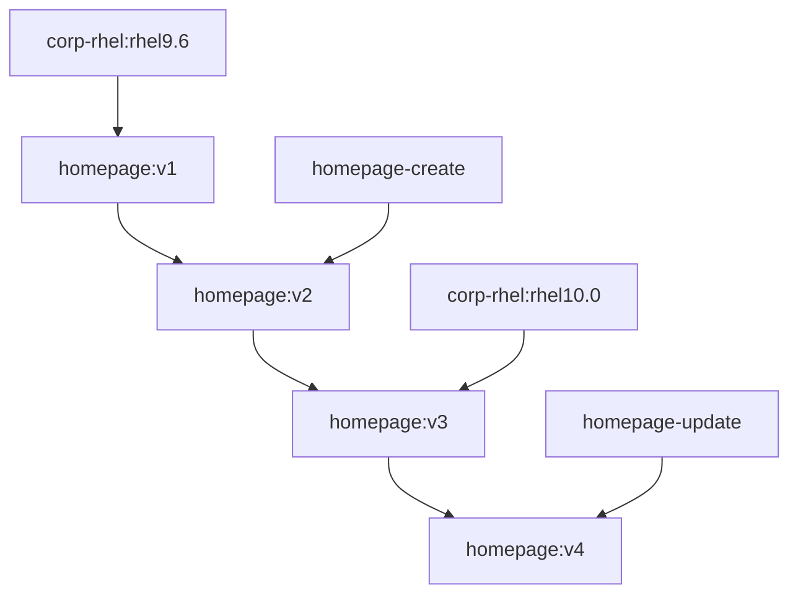

# Image Mode Demo

Image Mode Demo scripts
Draft container files, index.html, and config files to get an Image Mode demo story going.

## The worflow



## Image Mode Commands

We recommend that you set two variables in the terminal you are using for the logins to the Red Hat Registry and Quay.io.

```bash
QUAY_USER="your quay.io username not the email address"
REDHAT_USER="your Red Hat username, full email address may no longer work"
podman login -u $REDHAT_USER quay.io -p $REDHAT_PASSWORD && podman login -u $REDHAT_USER registry.redhat.io -p $REDHAT_PASSWORD
sudo mkdir -p /run/containers/0
sudo cp /run/user/1000/containers/auth.json /run/containers/0/auth.json #The user number 1000 may be different for your user
```

### Build the demo base image for RHEL 9.6

Build a base KVM virtual machine and deploy it to libvirt.
We will name our base (golden) image `corp-rhel:rhel9.6` and also tad it as our latest rhel base image as `corp-rhel:latest`.
We will then deploy a new virtual machine named `homepage` as this will be our new homepage http server.

Commands to build the RHEL 9.6 base image.

```bash
cd ~/imagemode/imagemodedemo/base-rhel96

sudo podman build -t quay.io/$QUAY_USER/bootc-demo-image:latest -t quay.io/jvdbreggen/bootc-demo-image:rhel9.6 -f Containerfile.rhel95

podman run -it --name rhel-bootc-qcow -p 8080:80 quay.io/jvdbreggen/bootc-demo-image:rhel9.6

podman push quay.io/jvdbreggen/bootc-demo-image:rhel9.6
podman push quay.io/jvdbreggen/bootc-demo-image:latest

sudo podman run \
--rm \
-it \
--privileged \
--pull=newer \
--security-opt label=type:unconfined_t \
-v $(pwd)/output:/output \
-v /var/lib/containers/storage:/var/lib/containers/storage \
registry.redhat.io/rhel9/bootc-image-builder:9.6 \
--type qcow2 --tls-verify=false \
quay.io/jvdbreggen/bootc-demo-image:rhel9.6

sudo mv output/qcow2/disk.qcow2 /var/lib/libvirt/images/rhel96-demo-base.qcow2

```
