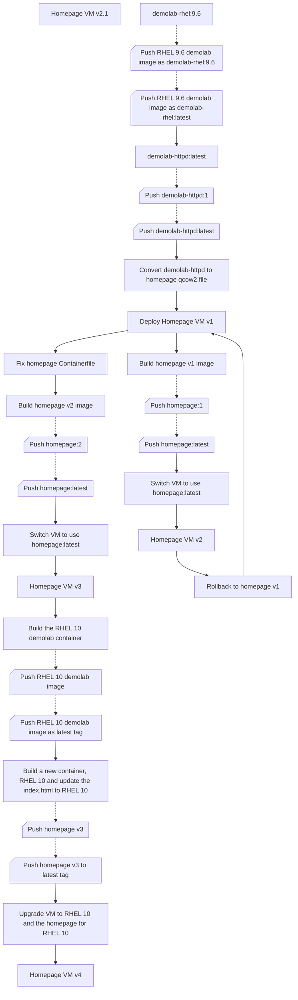
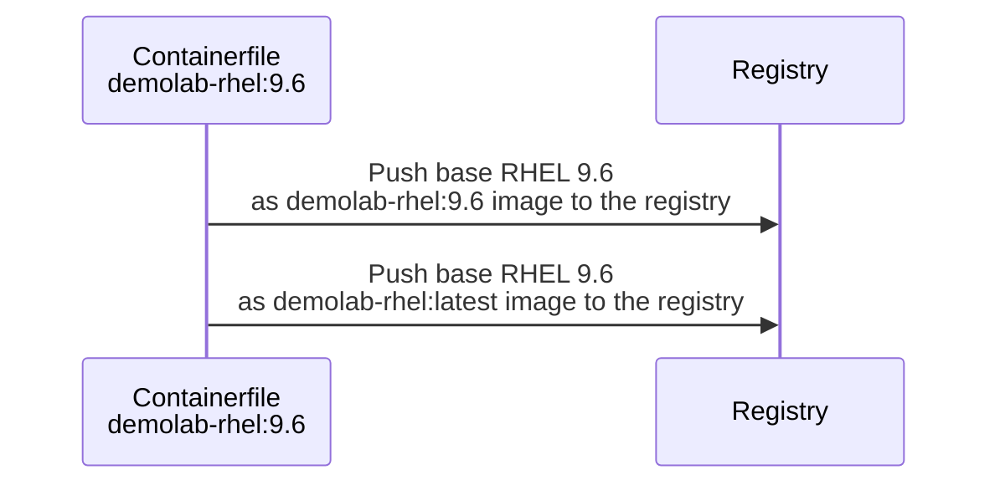
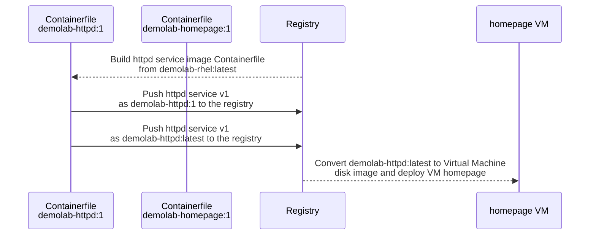
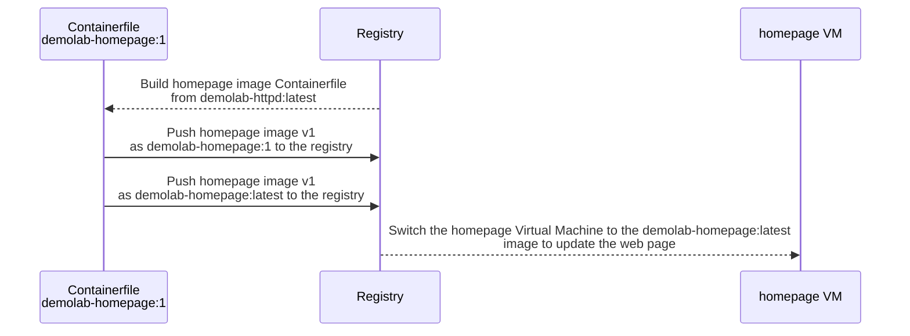
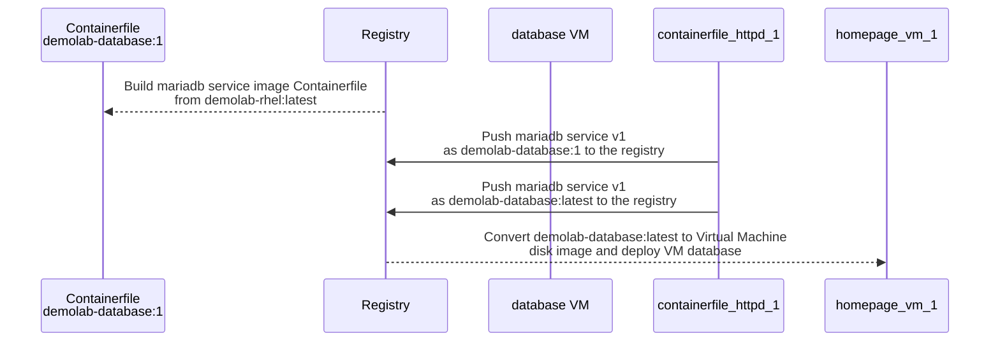
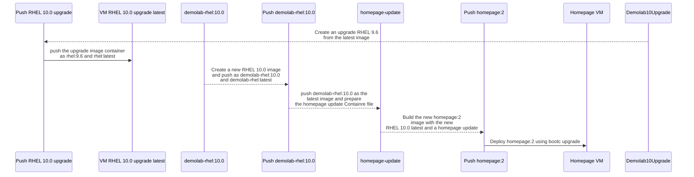
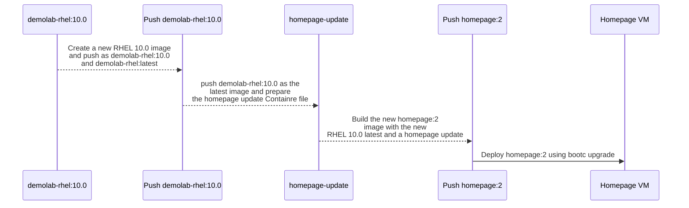
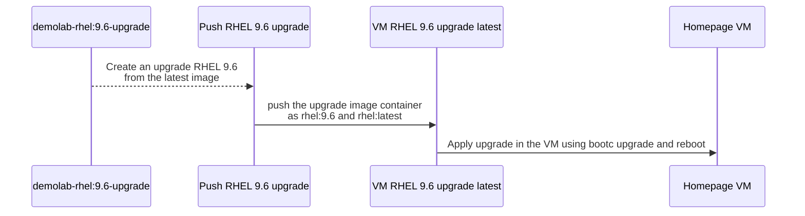
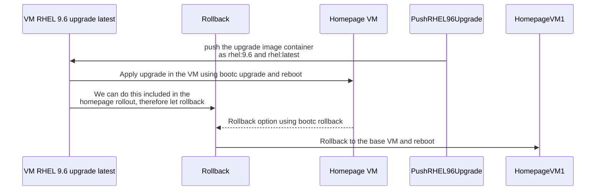

# Image Mode Demo

Image Mode Demo scripts, Containerfiles (Dockerfiles), webpages and workflows to demonstrate and understand how to workflow a "day in the life" Linux system administrator.
Draft container files, index.html, and config files to get an Image Mode workshop story going.

> [!NOTE]
> Branch build4 contains the latest updates

## The workflow

The overall plan of the workflow is to create a base RHEL "golden image" that we will call `demolab-rhel` and will base all our Virtual Machine (VM) KVM deployments from this image.
We will be deploying an httpd server as we can visually see the updates we are doing. This is based on our `demolab-rhel` image and we will add the httpd service and a homepage that we will upgrade in the process, and with the upgrades also upgrade our RHEL release.

The diagram below shows the various flows that can be used during this demo.

There is additional optional parts that is described in the next section. First, there is a flow for minor release upgrades that can be incorporated into the overall workflow. Second, we use the `demolab-rhel` base image to deploy a `demolab-database` server and maintain it the same way as our `demolab-homepage` server.
As a future aspect I want to add an Ansible playbook to use Ansible automation to upgrade the servers.


The flow is as follow:

1. Create a RHEL 9.6 base image and add a user that is part of the wheel group and push that image to the registry as our 9.6 and latest images.
2. Create our application images and VMs.
    1. Create a httpd server image based on our RHEL 9.6 base image adding the Apache httpd service.
    2. Create a MariaDB server image based on our RHEL 9.6 base image
3. Deploy the application images as a virtual machine servers.
    1. Pull and convert the httpd:latest image to our new Homepage virtual machine server.
    2. Pull and convert the mariadb:latest image to our new Database virtual machine server.
    3. Create qcow2 disk VM files from the images in the registry.
    4. Copy the disk images to our KVM pool and create new Virtual machines.
    5. Start the virtual machines and log into the VMs.
        1. Open the URL to the homepage VM in a browser.
4. Create the new homepage image and switch the VM to the homepage image.
    1. Build the new homepage image and tag it as version 1 and latest.
    2. Push the homepage image to the registry as version 1 and latest.
    3. In the homepage VM we deployed in step 3 switch to the new homepage image in the registry.
    4. Reboot the VM
    5. Refresh the homepage in the browser. This should be broken and we should receive a 404.
5. Rollback to get our old homepage back up and running.
    1. In the homepage VM issue the rollback command.
    2. Reboot the VM and after it booted make sure that the old homepage is running.
6. Fix the error in the homepage container file and push the updated image.
    1. Fix the FROM registry in the Container file.
    2. Build a new version of the homepage image and push it as a new version and the latest version.
    3. In the Homepage VM run the bootc switch command again to load the new homepage.
    4. Reboot the VM and this time the new homepage should disply in the browser.
7. Optional: Upgrade the Database server. This shows how different application servers are updated when the latest base RHEL image is updated.
    1. Using the same MariaDB Container file, create a new database image version and push it to a new version and latest.
    2. Upgrade the Database Virtual Machine and reboot.
8. Upgrade the base RHEL image to RHEL 10.
    1. Build a new RHEL 10 OS image tagging it as the RHEL 10 and latest images.
    2. Push the RHEL 10 and latest images to the registry.
9. Build a new version of the httpd service image.
    1. Build a new version of the httpd service image and tag it as the next version and latest. This will automatically use the latest RHEL image and upgrade the httpd service to RHEL 10.
    2. Push the new httpd version to the registry tagging it as the next version and the latest version.
9. Upgrade the homepage from the RHEL 9 welcome page to the new RHEL 10 homepage. As we do the upgrade of the homepage we will also pull in the RHEL 10.0 latest base image as the latest tag of the RHEL image is pointing to the RHEL 10 image. Push the upgrades to our registry as a new homepage version and the latest tag.
    1. Build a new version of the homepage using the homepage upgrade container file that contains the new RHEL 10 web page.
    2. Push the new homepage image to the registry using the next version number and latest as tags.
10. Upgrade the Homepage VM to the latest RHEL version (RHEL 10) and reboot.
    1. Use the bootc upgrade command in the Homepage VM to pull the new layers from the registry and reboot.
    2. Check that the OS release is RHEL 10 and that the homepage is updated in a browser.
11. Optional: Upgrade the Database server. This shows how different application servers are updated to a new RHEL release when the latest base RHEL image is upgraded.
    1. Using the same MariaDB Container file, create a new database image version and push it to a new version and latest.
    2. Upgrade the Database Virtual Machine and reboot.



### Optional additions to the workflow

This optional part to the workflow allows you to start with an early release of RHEL 9.6 and go through a minor release upgrade and CVE updates.

1. Start

## Building the demo

> [!CAUTION]
> The commands need to be updated for all the sections

We include the httpd service from the start in the base image.
An alternative is to create a vanilla base image with only our login user in the base image and then do the steps to install httpd service.

> What we need to do if we install httpd in a next step is after the VM is upgraded to add the httpd log directories in the VM. See the Notes at the end of this document.

### Set the environment

Setup of the terminal for building Image Mode images that we are going to push to the registry.
In this workshop we will be pushing to Red Hat Quay.

We recommend that you set two variables in the terminal you are using for the logins to the Red Hat Registry and Quay.io.

Using Quay we recommend that when you push the images to Quay that you make the repositories *public* by selecting the repository and using the Actions to set *Make Public*

```bash
QUAY_USER="your quay.io username not the email address"
REDHAT_USER="your Red Hat username, full email address may no longer work"
podman login -u $REDHAT_USER quay.io -p $REDHAT_PASSWORD && podman login -u $REDHAT_USER registry.redhat.io -p $REDHAT_PASSWORD
sudo mkdir -p /run/containers/0
sudo cp /run/user/1000/containers/auth.json /run/containers/0/auth.json #The user number 1000 may be different for your user
```

### Build the demo base image for RHEL

The first steps we will build our base (golden) image that we are going to use within the workshop. We will start with RHEL 9.6 and during the workshop update to RHEL 10.0.

This sequence diagram show the steps that we are going to take.



We will name our base (golden) image `demolab-rhel:9.6` and also tag it as our latest rhel base image as `demolab-rhel:latest`.

1. Use podman to build our corporate or demolab base RHEL "golden image". Change to the folder where you have cloned this repo and use `podman build` to build the image from the `Containerfile`.

```bash
cd $HOME/imagemodedemo/demolab-rhel9.6
```

```bash
podman build -t quay.io/$QUAY_USER/demolab-rhel:latest -t quay.io/$QUAY_USER/demolab-rhel:9.6 -f Containerfile
```

2. If we want to test our image we can run it in a container. You can log in with user `bootc-user` and password `redhat` and run `curl localhost` to test if the httpd service is running and you can see the base image welcome page. You can stop and exit the container with `sudo halt`.

```bash
podman run -it --rm --name demolab-rhel-96 -p 8080:80 quay.io/$QUAY_USER/demolab-rhel:9.6
```

3. Push the demolab base rhel image to our registry.

```bash
podman push quay.io/jvdbreggen/demolab-rhel:latest && podman push quay.io/jvdbreggen/demolab-rhel:9.6
```

> [!NOTE]
>In the optional steps we base the initial image on an older release of RHEL 9.6 so that we can demonstrate the upgrade process to the latest release and how to create base images based on a tested timestamp.
> In the optional section we create our base images for RHEL 9.6 on a specific version, for example `rhel:9.6-1747275992` and push this version to the registry as `demolab-rhel:9.6-1747275992` to reflect the version.

### Deploying the Homepage Virtual Machine

The following sequence diagram shows the steps that we will take to deploy our Homepage VM from the base image. We will name the VM as `homepage` and start to build



Now we are ready to create the virtual machine disk image that we are going to import into our new VM.

In some cases the podman command is unable to initially pull the image from the registry and returns an error that you have to pull the image from the registry before building the disk. Use a pull command to syncronise the local images.

1. Since we need to run podman as root to build the virtual machine qcow2 image file, we need to pull the image as root.

```bash
sudo podman pull quay.io/$QUAY_USER/demolab-rhel:9.6
```

2. We need to use podman to run the Image Mode virtual machine disk builder to pull the image from the registry and create the virtual machine disk file.

```bash
sudo podman run \
--rm \
-it \
--privileged \
--pull=newer \
--security-opt label=type:unconfined_t \
-v $(pwd)/config.toml:/config.toml:ro \
-v $(pwd):/output \
-v /var/lib/containers/storage:/var/lib/containers/storage registry.redhat.io/rhel9/bootc-image-builder:latest \
--type qcow2 \
--tls-verify=false \
quay.io/$QUAY_USER/demolab-rhel:latest
```

3. We will copy the new disk image to the libvirt images pool.

> You can move the disk image if you don't plan to use it for another VM using the mv command.

```bash
sudo cp ./qcow2/disk.qcow2 /var/lib/libvirt/images/homepage.qcow2
```

4. Create the VM from the copied virtual machine image qcow2 file. We will give it 4GB of RAM and set the boot option to UEFI.

```bash
sudo virt-install \
  --connect qemu:///system \
  --name homepage \
  --import \
  --boot uefi \
  --memory 4096 \
  --graphics none \
  --osinfo rhel9-unknown \
  --noautoconsole \
  --noreboot \
  --disk /var/lib/libvirt/images/homepage.qcow2
```

5. Start the VM.

```bash
sudo virsh start homepage
```

6. Login via ssh. You can use the following command that will get the IP address from virsh and log you in. 

```bash
VM_IP=$(sudo virsh -q domifaddr homepage | awk '{ print $4 }' | cut -d"/" -f1) && ssh bootc-user@$VM_IP
```

7. You can run a `curl localhost` to check if the httpd service with our base image homepage is working. Exit the VM with `exit`, `logout` or Ctrl-d.

8. Since we are going to refer to the quay.io registry, let us add $QUAY_USER to our .bashrc file.

```bash
sed -i '/unset rc[^\n]*/,$!b;//{x;//p;g};//!H;$!d;x;iQUAY_USER="your quay.io username not the email address"' .bashrc
```

9. and reload the .bashrc file to bring QUAY_USER into the variables.

```bash
source .bashrc
```

10. Finally for this section run the bootc status command to view the booted image registry source and the RHEL version.

```bash
sudo bootc status
```

>Booted image: quay.io/$QUAY_USER/demolab-rhel:9.6 \
>Digest: sha256:a48811e05........... \
>Version: 9.6 (2025-07-21 13:10:35.887718188 UTC)

Our virtual machine based on Image Mode is now running and we are ready to make updates to the web page.

#### Update the Homepage VM to our Image Mode web page

The next steps we will update the web page in our `homepage` VM from the basic RHEL webpage that we created to an more updated web page showing the advantages of using Image Mode.

The following sequence diagram shows the steps that we will take to deploy our Homepage VM from the base image. We will name the VM as `homepage` and start to build



On our image builder server we will build a new Image Mode for RHEL 9 homepage image that we will deploy to the VM.

1. Change directory to the new web page Container file and the updated web page at `homepage-new`. You can open the `index.html` file in the `html` directory to see the updates to the homepage.

```bash
cd ../homepage-create
```

2. Build the new homepage images from the `Containerfile`.

```bash
podman build -t quay.io/$QUAY_USER/homepage:1 -t quay.io/$QUAY_USER/homepage:latest -f Containerfile
```

3. Push the image to the registry using the `demolab-homepage:1` and `demopage-homepage:latest` tags.

```bash
podman push quay.io/$QUAY_USER/homepage:latest && podman push quay.io/$QUAY_USER/homepage:1
```

4. Switch to the Homepage virtual machine and login to the `homepage` VM using ssh.

```bash
VM_IP=$(sudo virsh -q domifaddr homepage | awk '{ print $4 }' | cut -d"/" -f1) && ssh bootc-user@$VM_IP
```
5. We are now going to use the `bootc switch` command to switch the virtual machine to the homepage image in the registry.

> NOTE! If you didn't add the `$QUAY_USER` to the `.bashrc` file then run the following 

```bash
QUAY_USER="your quay.io username not the email address"
```
```bash
sudo bootc switch quay.io/$QUAY_USER/homepage:latest
```

6. Let us check the we have staged the new homepage image in the virtual machine.

```bash
sudo bootc status
```

> Staged image: quay.io/$QUAY_USER/homepage:latest \
        Digest:  sha256:2be7b1...... \
       Version: 9.6 (2025-07-21 15:43:03.624175287 UTC) \
       \
● Booted image: quay.io/$QUAY_USER/demolab-rhel:9.6 \
        Digest: sha256:a48811...... \
       Version: 9.6 (2025-07-21 13:10:35.887718188 UTC)

7. and we check that we have the old RHEL 9 homepage without our new Image Mode content.

```bash
curl localhost
```

8. We need to reboot the virtual machine to activate the new layers and have our new home page.

```bash
sudo reboot
```

9. Login to the virtual machine to verify that we have a new updated Image Mode homepage.

```bash
VM_IP=$(sudo virsh -q domifaddr homepage | awk '{ print $4 }' | cut -d"/" -f1) && ssh bootc-user@$VM_IP
curl localhost
```

10. Something went wrong! Our httpd service has failed during the update! Let us check the service.

```bash
sudo systemctl status httpd
```

11. There is no httpd service. We will rollback in the next section and fix the problem.

#### Rollback and fix our homepage


#### Build the database virtual machine

We will then deploy a new virtual machine named `database` as this will be our new homepage http server.
We will build the two images in one linked command and push it as the version 1 and latest images to our registry.



### Upgrade the RHEL base image to RHEL 10



### Upgrade the VM to RHEL 10 and update the homepage

in the builder machine in the demolab-rhel10.0 directory



```bash
cd ../demolab-rhel10.0
```

```bash
podman build -t quay.io/$QUAY_USER/demolab-rhel:latest -t quay.io/$QUAY_USER/demolab-rhel:10.0 -f Containerfile
```

```bash
podman push quay.io/$QUAY_USER/demolab-rhel:latest && podman push quay.io/$QUAY_USER/demolab-rhel:10.0
```

In the VM

```bash
QUAY_USER="your quay.io username not the email address"
[bootc-user@localhost ~]$ sudo bootc switch quay.io/$QUAY_USER/demolab-rhel:latest
```

The homepage is lost, we need to roll back

```bash
sudo bootc status
```

>● Booted image: quay.io/$QUAY_USER/demolab-rhel:latest \
    Digest:  sha256:7c46d6....... \
    Version: 10.0 (2025-07-21 16:04:36.100285429 UTC) \
\
  Rollback image: quay.io/$QUAY_USER/homepage:latest \
          Digest: sha256:2be7b1...... \
         Version: 9.6 (2025-07-21 15:43:03.624175287 UTC)

```bash
sudo bootc rollback
sudo reboot
sudo bootc status
```

>● Booted image: quay.io/jvdbreggen/homepage:latest\
        Digest: sha256:2be7b1...... \
       Version: 9.6 (2025-07-21 15:43:03.624175287 UTC) \
 \
  Rollback image: quay.io/jvdbreggen/demolab-rhel:latest \
          Digest: sha256:7c46d6...... \
         Version: 10.0 (2025-07-21 16:04:36.100285429 UTC)

The note below is for the old flow, I think I have it fixed.
> [!NOTE]
> I tried to do an upgrade and then with the homepage still on RHEL 9 to do a rollback and the update the homepage and deploy RHEL 10 again. This breaks SSH.

we need to do this another way
in the image builder machine
our container file already points to the demolab-rhel:latest image in the repo. we need to do an update

```bash
cd ../homepage-create
podman build -t quay.io/$QUAY_USER/homepage:2 -t quay.io/$QUAY_USER/homepage:latest -f Containerfile
podman push quay.io/$QUAY_USER/homepage:1 && podman push quay.io/$QUAY_USER/homepage:latest
```

in the homepage VM

```bash
sudo bootc upgrage --check
```

>Update available for: docker://quay.io/jvdbreggen/homepage:latest \
  Version: 10.0 \
  Digest: sha256:0c5416...... \
Total new layers: 77    Size: 885.4 MB \
Removed layers:   76    Size: 1.4 GB \
Added layers:     76    Size: 885.4 MB

Apply the update - not working sshd broken after reboot
Only a few layers, I thought we upgrade to RHEL 10?

```bash
sudo bootc upgrade
sudo bootc status
```

> Staged image: quay.io/$QUAY_USER/homepage:latest \
        Digest: sha256:0c5416...... \
       Version: 10.0 (2025-07-21 17:25:47.229186615 UTC) \
 \
● Booted image: quay.io/$QUAY_USER/homepage:latest \
        Digest: sha256:2be7b1...... \
       Version: 9.6 (2025-07-21 15:43:03.624175287 UTC) \
 \
  Rollback image: quay.io/$QUAY_USER/demolab-rhel:latest \
          Digest: sha256:7c46d6...... \
         Version: 10.0 (2025-07-21 16:04:36.100285429 UTC)

```bash
sudo reboot
```

This is to show how we update the base OS on an existing deployment. Usually this will be done during an application, or in this case, a homepage update.
Let's rollback again and then apply a new homepage whereby the RHEL 10 OS upgrade will automatically be pulled along with the update using the latest demolab-rhel image in the repository.

---

---

---

## The next part is old and will be replaced

### Optional flows

#### OPTIONAL: Upgrade the base RHEL 9.6 image in the registry to the latest

Upgrade the RHEL 9.6 image to the latest RHEL 9.6 and push it to the registry. We will update the VM from this new image in the registry.



### OPTIONAL: Upgrade the VM to the latest RHEL 9.6 image and do a roll back

Upgrade the VM to the latest RHEL 9.6 using the new image in the registry. We will rollback so that we actually use do the upgrade in the deployment of the home page.



## Notes

Installing httpd on a bare RHEL os VM server you need to create the dirs in /var

```bash
RUN sudo mkdir -p /var/log/httpd
RUN sudo mkdir -p /var/lib/httpd
```

```bash
c "give me the command to convert the image mode RHEL container at quay.io/$QUAY_USER/demolab-rhel:latest to a qcow2 file using the control.json file that is in this directory"
```

## Ideas

New flow for the homepage VM

1. build the httpd server image on rhel 9.6
    1. deploy the homepage vm
    2. show simple web site
2. build the homepage-create image but use FROM rhel 9.6
    1. bootc switch to the homepage image
    2. the httpd service was removed as we did not build from the httpd image
    3. use bootc rollback and reboot
    4. the basic homepage is working again
3. Change the homepage create container file FROM httpd image
    1. build a new version and push
4. In the homepage VM do the bootc switch again
    1. do a bootc status, show staged, current and rollback
    2. reboot
    3. refresh the page and it will show the new homepage on image mode
5. then we continue with the RHEL 10 home page upgrade that includes RHEL 10
    1. build the RHEL 10 demolab image and push to rhel:10 and rhel:latest
    2. build a new version of the http image
    3. build the upgrade rhel 10 homepage
    4. upgrade the homepage vm with bootc upgrade
    5. show the update web page

Build an ansible playbook and inventory that will upgrade the VMs and reboot when new releases are pushed.
