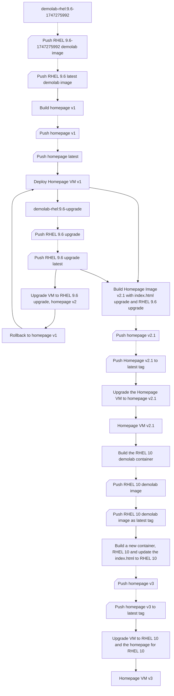
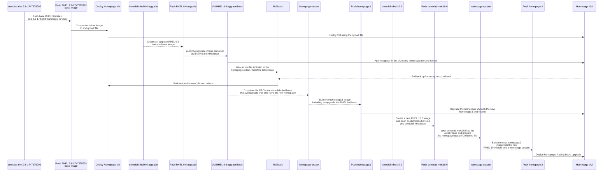
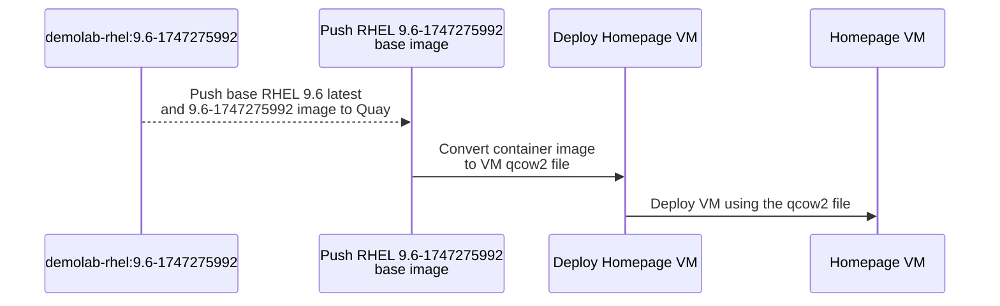
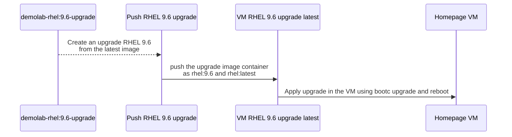
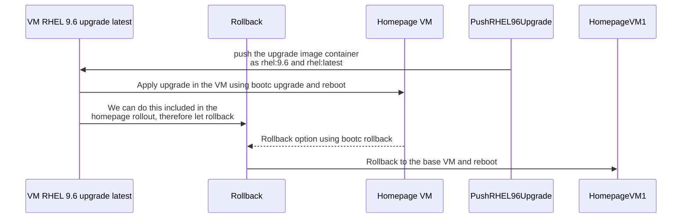
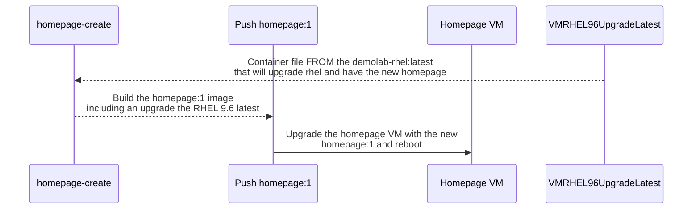
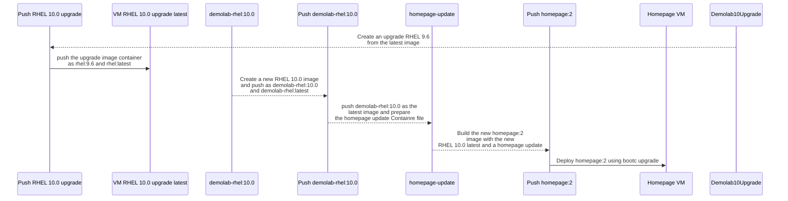
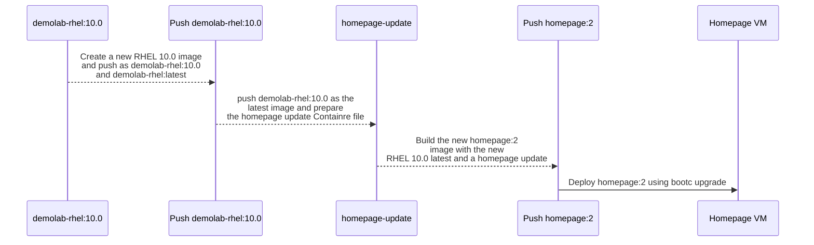

# Image Mode Demo

Image Mode Demo scripts
Draft container files, index.html, and config files to get an Image Mode workshop story going.

## The workflow

The diagram below shows the various flows that can be used during this demo.
The flow is as follow:

1. Create a RHEL 9.6-1747275992 base image with a user that is part of the wheel group and push that image to the registry as our 9.6 and latest images.
2. Create our application images and VMs.
    1. Create a homepage image based on our RHEL 9.6 base image adding the Apache httpd service.
    2. Create a MariaDB server image based on our RHEL 9.6 base image
3. Deploy the application images as a virtual machine servers.
    1. Pull and convert the homepage:latest image to our new Homepage virtual machine server.
    2. Pull and convert the mariadb:latest image to our new Database virtual machine server.
4. Optional rollback demo.
    1. Upgrade the homepage from the basic RHEL 9 welcome page to the new homepage that includes the Image Mode details.
    2. Push the upgrade to the registry
    3. Upgrade our VM and reboot
    4. Rollback. Since we wanted to include the RHEL 9.6 latest code in our image as well, we are going to roll back and peform the next steps in upgrading RHEL 9.6 as well then then deploy again. 
5. Upgrade the base RHEL 9.6 image to the latest RHEL 9.6 image and push the upgrades to the repository as 9.6 and latest.
6. Upgrade the homepage from the basic RHEL 9 welcome page to include Image Mode detail. As we do the upgrade of the homepage we will also pull in the RHEL 9.6 latest base image. Push the upgrades to our registry as a new homepage version and the latest tag.
7. Upgrade the Homepage VM to the latest version and reboot.
8. Optional: Upgrade the Database server. This shows how different application servers are updated when the latest base RHEL image is updated. 
    1. Using the same MariaDB Container file, create a new database image version and push it to a new version and latest.
    2. Upgrade the Database Virtual Machine and reboot.
9. Upgrade the base RHEL image to RHEL 10.
    1. Create a new RHEL 10 image and push it to the registry as a new RHEL 10 image and update the latest RHEL image tag to point to the new RHEL 10 image.
10. Upgrade the homepage from the RHEL 9 welcome page to the new RHEL 10 homepage. As we do the upgrade of the homepage we will also pull in the RHEL 10.0 latest base image as the latest tag of the RHEL image is pointing to the RHEL 10 image. Push the upgrades to our registry as a new homepage version and the latest tag.
7. Upgrade the Homepage VM to the latest RHEL version (RHEL 10) and reboot.
8. Optional: Upgrade the Database server. This shows how different application servers are updated to a new RHEL release when the latest base RHEL image is upgraded. 
    1. Using the same MariaDB Container file, create a new database image version and push it to a new version and latest.
    2. Upgrade the Database Virtual Machine and reboot.




<!-- The following diagram will be updated as I work through the workflow. -->

## Building the demo

> [!CAUTION]
> The commands need to be updated for all the sections

We include the httpd service from the start in the base image. 
An alternative is to create a vanilla base image with only our login user in the base image and then do the steps to install httpd service. 

> What we need to do if we install httpd in a next step is after the VM is upgraded to add the httpd log directories in the VM. See the Notes at the end of this document.

### Set the environment

Setup of the terminal for building Image Mode images that we are going to push to the registry.
In this workshop we will be pushing to Red Hat Quay.

We recommend that you set two variables in the terminal you are using for the logins to the Red Hat Registry and Quay.io.

Using Quay we recommend that when you push the images to Quay that you make the repositories *public* by selecting the repository and using the Actions to set *Make Public*

```bash
QUAY_USER="your quay.io username not the email address"
REDHAT_USER="your Red Hat username, full email address may no longer work"
podman login -u $REDHAT_USER quay.io -p $REDHAT_PASSWORD && podman login -u $REDHAT_USER registry.redhat.io -p $REDHAT_PASSWORD
sudo mkdir -p /run/containers/0
sudo cp /run/user/1000/containers/auth.json /run/containers/0/auth.json #The user number 1000 may be different for your user
```

### Build the demo base image for RHEL

The first steps we will build our base (golden) image that we are going to use within the workshop. We will start with RHEL 9.6 and during the workshop update to RHEL 10.0.

We will name our base (golden) image `demolab-rhel:9.6` and also tag it as our latest rhel base image as `demolab-rhel:latest` and `demolab-rhel:9.6-1747275992` to reflect the version. We base the initial image on an older release of RHEL 9.6 so that we can demonstrate the upgrade process to the latest release.

We will then deploy a new virtual machine named `homepage` as this will be our new homepage http server.



Commands to build the RHEL 9.6 base image.

> [!CAUTION]
> The commands need to be updated

Change to the folder where you have cloned this repo

```bash
cd $HOME/imagemodedemo/demolab-rhel9.6
```

```bash
podman build -t quay.io/$QUAY_USER/demolab-rhel:latest -t quay.io/$QUAY_USER/demolab-rhel:9.6 -f Containerfile
```

If we want to test our image we can run it in a container.

You can log in with user `bootc-user` and password `redhat` and run `curl localhost` to test if the httpd service is running and you can see the base image welcome page. You can stop and exit the container with `sudo halt`.

```bash
podman run -it --rm --name demolab-rhel-96 -p 8080:80 quay.io/$QUAY_USER/demolab-rhel:9.6
```

Next we are going to push our images to the Quay repository.

```bash
podman push quay.io/$QUAY_USER/demolab-rhel:rhel9.6
podman push quay.io/$QUAY_USER/demolab-rhel:latest
```

Now we are ready to create the virtual machine disk image that we are going to import into our new VM.

In some cases the podman command is unable to initially pull the image from the registry and returns an error that you have to pull the image from the registry before building the disk. Use a pull command to syncronise the local images.

```bash
sudo podman pull quay.io/$QUAY_USER/demolab-rhel:9.6
```

```bash
sudo podman run \
--rm \
-it \
--privileged \
--pull=newer \
--security-opt label=type:unconfined_t \
-v $(pwd)/config.toml:/config.toml:ro \
-v $(pwd):/output \
-v /var/lib/containers/storage:/var/lib/containers/storage registry.redhat.io/rhel9/bootc-image-builder:latest \
--type qcow2 \
--tls-verify=false \
quay.io/$QUAY_USER/demolab-rhel:latest
```

We will copy the new disk image to the libvirt images pool.
> You can move the disk image if you don't plan to use it for another VM using the mv command.

```bash
sudo cp ./qcow2/disk.qcow2 /var/lib/libvirt/images/homepage.qcow2
```

Create the VM from the copied virtual machine image qcow2 file.
We will give it 4GB of RAM and set the boot option to UEFI.

```bash
sudo virt-install \
  --connect qemu:///system \
  --name homepage \
  --import \
  --boot uefi \
  --memory 4096 \
  --graphics none \
  --osinfo rhel9-unknown \
  --noautoconsole \
  --noreboot \
  --disk /var/lib/libvirt/images/homepage.qcow2
```

Start the VM.

```bash
sudo virsh start homepage
```

and login via ssh. You can use the following command that will get the IP address from virsh and log you in.

```bash
VM_IP=$(sudo virsh -q domifaddr homepage | awk '{ print $4 }' | cut -d"/" -f1) && ssh bootc-user@$VM_IP
```

You can run a `curl localhost` to check if the httpd service with our base image homepage is working. Exit the VM with `exit`, `logout` or Ctrl-d.

Since we are going to refer to the quay.io registry, let us add $QUAY_USER to our .bashrc file.

```bash
sed -i '/unset rc[^\n]*/,$!b;//{x;//p;g};//!H;$!d;x;iQUAY_USER="your quay.io username not the email address"' .bashrc
```

and reload the .bashrc file to bring QUAY_USER into the variables.

```bash
source .bashrc
```

Finally for this section run the bootc status command to view the booted image registry source and the RHEL version.

```bash
sudo bootc status
```

>Booted image: quay.io/$QUAY_USER/demolab-rhel:9.6 \
>Digest: sha256:a48811e05........... \
>Version: 9.6 (2025-07-21 13:10:35.887718188 UTC)

### Upgrade the base RHEL 9.6 image in the registry to the latest

Upgrade the RHEL 9.6 image to the latest RHEL 9.6 and push it to the registry. We will update the VM from this new image in the registry.



### OPTIONAL: Upgrade the VM to the latest RHEL 9.6 image and do a roll back

Upgrade the VM to the latest RHEL 9.6 using the new image in the registry. We will rollback so that we actually use do the upgrade in the deployment of the home page.



### Create the home page and install Apache



Builder machine:

```bash
cd ../homepage-create

podman build -t quay.io/$QUAY_USER/homepage:1 -t quay.io/$QUAY_USER/homepage:latest -f Containerfile

podman push quay.io/$QUAY_USER/homepage:1 && podman push quay.io/$QUAY_USER/homepage:latest
```

Homepage vm:
Login to the VM using ssh

```bash
QUAY_USER="your quay.io username not the email address"
sudo bootc switch quay.io/$QUAY_USER/homepage:latest
sudo bootc status
```

> Staged image: quay.io/$QUAY_USER/homepage:latest \
        Digest:  sha256:2be7b1...... \
       Version: 9.6 (2025-07-21 15:43:03.624175287 UTC) \
       \
● Booted image: quay.io/$QUAY_USER/demolab-rhel:9.6 \
        Digest: sha256:a48811...... \
       Version: 9.6 (2025-07-21 13:10:35.887718188 UTC)

check homepage `curl localhost`

```bash
sudo reboot
```

ssh login

```bash
VM_IP=$(sudo virsh -q domifaddr homepage | awk '{ print $4 }' | cut -d"/" -f1) && ssh bootc-user@$VM_IP
curl localhost
```

### Upgrade the RHEL image to RHEL 10




### Upgrade the VM to RHEL 10 and update the homepage
in the builder machine in the demolab-rhel10.0 directory



```bash
cd ../demolab-rhel10.0
```

```bash
podman build -t quay.io/$QUAY_USER/demolab-rhel:latest -t quay.io/$QUAY_USER/demolab-rhel:10.0 -f Containerfile
```

```bash
podman push quay.io/$QUAY_USER/demolab-rhel:latest && podman push quay.io/$QUAY_USER/demolab-rhel:10.0
```

In the VM

```bash
QUAY_USER="your quay.io username not the email address"
[bootc-user@localhost ~]$ sudo bootc switch quay.io/$QUAY_USER/demolab-rhel:latest
```

The homepage is lost, we need to roll back

```bash
sudo bootc status
```

>● Booted image: quay.io/$QUAY_USER/demolab-rhel:latest \
    Digest:  sha256:7c46d6....... \
    Version: 10.0 (2025-07-21 16:04:36.100285429 UTC) \
\
  Rollback image: quay.io/$QUAY_USER/homepage:latest \
          Digest: sha256:2be7b1...... \
         Version: 9.6 (2025-07-21 15:43:03.624175287 UTC)

```bash
sudo bootc rollback
sudo reboot
sudo bootc status
```

>● Booted image: quay.io/jvdbreggen/homepage:latest\
        Digest: sha256:2be7b1...... \
       Version: 9.6 (2025-07-21 15:43:03.624175287 UTC) \
 \
  Rollback image: quay.io/jvdbreggen/demolab-rhel:latest \
          Digest: sha256:7c46d6...... \
         Version: 10.0 (2025-07-21 16:04:36.100285429 UTC)

> [!NOTE]
> I tried to do an upgrade and then with the homepage still on RHEL 9 to do a rollback and the update the homepage and deploy RHEL 10 again. This breaks SSH.

we need to do this another way
in the image builder machine
our container file already points to the demolab-rhel:latest image in the repo. we need to do an update

```bash
cd ../homepage-create
podman build -t quay.io/$QUAY_USER/homepage:2 -t quay.io/$QUAY_USER/homepage:latest -f Containerfile
podman push quay.io/$QUAY_USER/homepage:1 && podman push quay.io/$QUAY_USER/homepage:latest
```

in the homepage VM

```bash
sudo bootc upgrage --check
```

>Update available for: docker://quay.io/jvdbreggen/homepage:latest \
  Version: 10.0 \
  Digest: sha256:0c5416...... \
Total new layers: 77    Size: 885.4 MB \
Removed layers:   76    Size: 1.4 GB \
Added layers:     76    Size: 885.4 MB

Apply the update - not working sshd broken after reboot
Only a few layers, I thought we upgrade to RHEL 10?

```bash
sudo bootc upgrade
sudo bootc status
```

> Staged image: quay.io/$QUAY_USER/homepage:latest \
        Digest: sha256:0c5416...... \
       Version: 10.0 (2025-07-21 17:25:47.229186615 UTC) \
 \
● Booted image: quay.io/$QUAY_USER/homepage:latest \
        Digest: sha256:2be7b1...... \
       Version: 9.6 (2025-07-21 15:43:03.624175287 UTC) \
 \
  Rollback image: quay.io/$QUAY_USER/demolab-rhel:latest \
          Digest: sha256:7c46d6...... \
         Version: 10.0 (2025-07-21 16:04:36.100285429 UTC)

```bash
sudo reboot
```

This is to show how we update the base OS on an existing deployment. Usually this will be done during an application, or in this case, a homepage update.
Let's rollback again and then apply a new homepage whereby the RHEL 10 OS upgrade will automatically be pulled along with the update using the latest demolab-rhel image in the repository.

## Notes

Installing httpd on a bare RHEL os server you need to create the dirs in /var

```bash
RUN sudo mkdir -p /var/log/httpd
RUN sudo mkdir -p /var/lib/httpd
```

```bash
c "give me the command to convert the image mode RHEL container at quay.io/$QUAY_USER/demolab-rhel:latest to a qcow2 file using the control.json file that is in this directory"
```
